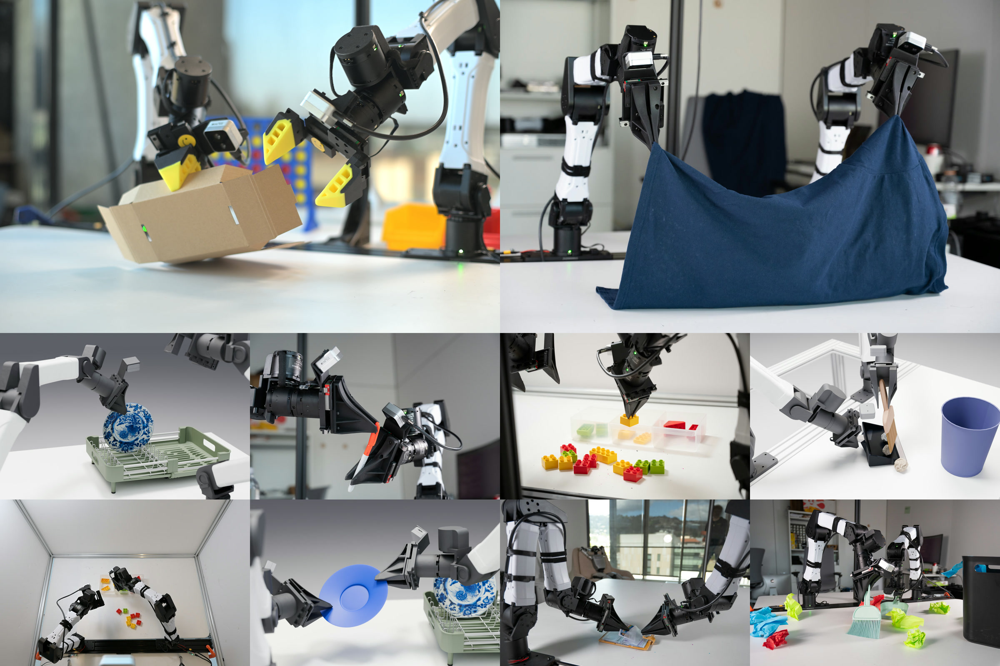

# **Scalable Behavior Cloning with Open Data, Training, and Evaluation**

<p align="center">
  <strong>
    <a href="https://abc.bot">Project Website</a> |
    <a href="todo">Paper</a> |
    <a href="https://huggingface.co/datasets/XDOF/ABC-130k">Raw Data</a>
  </strong>
</p>




Code for the ABC project.

> Note: we have released a minimal training pipeline for ABC-DiT & conversion scripts for the data. We also re-host a small subset of the sim data and real data for 1 task to allow users to get started. Please check back later for the full code release, including VLA training, real deployment infra & pretrained checkpoints.


## Release Roadmap
- [x] June 17 -- Release Minimal Training Pipeline
- [ ] End of June -- Release all sim data 
- [ ] By end of July -- full code release

## Setup

```bash
# Install uv if you don't have it.
curl -LsSf https://astral.sh/uv/install.sh | sh
```

```bash
# Install ffmpeg.
sudo apt-get install -y ffmpeg     # on Linux
```

```bash
# Pin Python and create the project venv. uv reads pyproject.toml here.
cd abc
uv python pin 3.12
uv sync
```

## Training

First we need to download the requisite data (norm stats and either a sample or full data.)
```bash
uv run prepare.py            # preview (a few episodes of data, ~130MB)
uv run prepare.py --full     # all data for bottles in bin (~35GB)
uv run prepare.py --checkpoint  # add to also pull the pretrained 75k policy (~7.7GB)
```

This populates the cache dir (default `cache/`, or `ABC_CACHE` if set) with:

```
cache/
  norm_stats.json                       # state/action z-score stats
  train_real/episode_<uuid>/{states_actions.bin, combined_camera-images-rgb.mp4, episode_metadata.json}
  val_real/...
  train_sim/...
  val_sim/...
```

Set `ABC_CACHE=/path/to/cache` before running commands if you want the cache
outside the repository.

:warning: Note: `prepare.py` does not download DINO weights. Review and follow the DINO license terms, then download the weights from [Meta](https://ai.meta.com/resources/models-and-libraries/dinov3-downloads/) or [Hugging Face](https://huggingface.co/facebook/dinov3-vitb16-pretrain-lvd1689m). Save the file as `dinov3_vitb16_pretrain_lvd1689m.pth` in the cache dir. :warning:

The command to run training is below. Note that this is for single node training with 8 GPUs, change `nproc-per-node` if you want.

```bash
uv run torchrun --standalone --nproc-per-node 8 train.py
```
The dataclass config is exposed as CLI flags; `uv run python train.py --help`
shows training, optimizer, flow, CLIP asset, and model options such as
`--model.hidden-size`, `--model.depth`, and `--model.camera-keys`. The default
model config is the checkpoint-compatible ABC-DiT XL shape.

If you pulled with `--full` above, this checkpoint is expected to work for
the bottles in bin task in both sim and real. The performance should be similar
to [this](assets/bottles_real.mp4).

Training defaults in `abc_minimal/config.py` match the production reference
finetune (lr 1e-4 with a 1k-step linear warmup, AdamW(0.9, 0.95), wd 0.01,
grad clip 10, prefix conditioning max 4 with noise 0.05, 10% state masking,
batch 90/GPU, 75k steps, hours-weighted 2-component mixture).
The dataclass config is exposed as CLI flags; `uv run python train.py --help`
shows training, optimizer, flow, CLIP asset, and model options such as
`--model.hidden-size`, `--model.depth`, and `--model.camera-keys`. The default
model config is the checkpoint-compatible ABC-DiT XL shape. If you have fewer GPUs
than 8 you may need to reduce nproc per node or if you have less than 80Gb of
VRAM you may need to reduce `--batch-size`.

The above training yields ~2.6-3 iterations / sec on H100/H200. It achieves a training
loss of ~`0.048` after 75k steps.

## Evaluation

You can either evaluate a checkpoint you trained yourself (drops into
`cache/finetune_checkpoints/last.pt`) or download our public
pretrained 75k-step bottles policy:

```bash
# Pulls cache/bottles_75k.pt (~7.7 GB) from the public bucket,
# alongside norm_stats.json and the preview tar.
uv run prepare.py --checkpoint
```

To visualize the policy live:

```bash
uv run viz_policy.py --sim.checkpoint cache/bottles_75k.pt --port 8080
```

opens a viser window at `localhost:8080`.

`eval_policy.py` runs a more systematic evaluation:

```bash
# 20 worlds, save a video of each rollout, log per-chunk progress.
uv run eval_policy.py \
    --checkpoint cache/bottles_75k.pt \
    --num-worlds 20 \
    --save-video --log-every-chunk

# Output: $REPO/outputs/sim_eval_put_bottles/
#   summary.json     — success_rate, num_success, mean_max_bottles_in_bin
#   world_*.mp4      — per-world rollout videos (with --save-video)
```

Useful flags:

- `--num-worlds N` — independent random scenes (default 5).
- `--num-chunks N` — action chunks per rollout; each chunk is
`--execute-chunk-dim` actions (defaults: 60 chunks × 15 = 900 sim steps).
- `--diffusion-steps N` — flow-matching Euler steps per inference
(default 10, matches production).
- `--checkpoint` — accepts a local `.pt` path or `s3://…/<file>.pt`.
- `--norm-stats-path` — explicit `norm_stats.json` (otherwise uses the
one bundled in the checkpoint).
- `--fast-inference` / `--no-fast-inference` (default on) — bf16 +
torch.compile + CUDA-graph captured `sample_actions`. ~5× faster
inference; first call pays a one-time ~25 s compile cost.
- `--vanilla-physics` / `--no-vanilla-physics` (default on) — use
vanilla CPU `mujoco.mj_step` for env physics instead of single-world
mjwarp.  This is because for single environments, it's faster to
use vanilla mujoco. Rendering still happens in MJWarp.

Note that the first launch compiles MJWarp's CUDA kernels (~1 min).

## Episode exports & training data format

While we host a single task in training format, there are many more in the ABC Dataset.
The ABC-130k MCAPs are hosted on Hugging Face at
[`XDOF/ABC-130k`](https://huggingface.co/datasets/XDOF/ABC-130k). The dataset
is gated, so accept access on the dataset page and set `HF_TOKEN` before
downloading.

Download all MCAPs for one task and convert them in place:

```bash
uv run export_hf_task.py --task organize_the_condiment_bottles
```

By default this downloads both `train` and `val`, stages raw MCAPs under
`$ABC_CACHE/hf_tasks/<task>/`, runs `export_mcap.py`, writes converted episodes
to `$ABC_CACHE/train_real/` and `$ABC_CACHE/val_real/`, then deletes the staged
raw MCAPs after each successful split conversion. For a quick smoke test:

```bash
uv run export_hf_task.py --task organize_the_condiment_bottles --split train --max-episodes 1
```

If you already have local MCAPs, call the lower-level converter directly:

```bash
uv run export_mcap.py ./train_run_1 ./out
```

The input is expected to look like:

```text
train_run_1/
  <task_name>/
    episode_<uuid>/
      episode.mcap
```

You can also pass the number of worker processes:

```bash
uv run export_mcap.py ./train_run_1 ./out 8
```

Each output episode is written to `./out/episode_<uuid>/` in the same format
the trainer reads:

```text
episode_<uuid>/
  states_actions.bin               # (num_steps, 28) float64: 14 states + 14 actions
  combined_camera-images-rgb.mp4   # 30 fps vertical stack of 224x224 camera views
  episode_metadata.json            # task name, cameras, resolutions, timing, num_steps
```

The mp4 is encoded in a manner that allows for efficient dataloading. For details, see the ABC paper.

## Licenses

This repository includes and adapts code from the following third-party
projects. Original license files and copyright headers are retained in all
cases. Bundled license texts live under `abc_minimal/third_party/`.

| Project | License | License file | Inclusion | What we use/adapt |
| --- | --- | --- | --- | --- |
| [DINOv3](https://github.com/facebookresearch/dinov3) | DINOv3 License (Meta) | [`abc_minimal/third_party/dinov3/LICENSE.md`](abc_minimal/third_party/dinov3/LICENSE.md) | Adapted (`abc_minimal/dit.py`); pretrained weights downloaded by the user | ViT-B/16 vision backbone (`DinoRope`, `DinoAttention`, `DinoMlp`, etc.) |
| [OpenAI CLIP](https://github.com/openai/CLIP) | MIT | [`abc_minimal/third_party/clip/LICENSE`](abc_minimal/third_party/clip/LICENSE) | Adapted (`abc_minimal/dit.py`); ViT-B/32 text weights + BPE vocab downloaded at runtime | CLIP text encoder + BPE tokenizer (`CLIPBPETokenizer`, `CLIPTextTower`, `CLIPTextEmbedder`) |
| [i2rt YAM](https://github.com/i2rt-robotics) | MIT | [`assets/put_bottles/assets/i2rt_yam/LICENSE`](assets/put_bottles/assets/i2rt_yam/LICENSE) | Vendored under `assets/put_bottles/assets/i2rt_yam/` | YAM robot MuJoCo model, meshes, and scene assets |

### DINOv3 use restrictions

The DINOv3 License prohibits use of the DINO Materials (including weights and
derivatives) for: military purposes; activities subject to ITAR or other
export-control regimes covering defense articles; nuclear applications;
espionage; and the development, manufacture, or use of weapons. Downstream
users who load DINOv3 weights through this codebase are bound by these
restrictions; see `abc_minimal/third_party/dinov3/LICENSE.md` for the full
license text.


## Citation

Please cite this work as

```
@article{abc2026,
  title   = {Scalable Behavior Cloning with Open Data, Training, and Evaluation},
  author  = {Allshire, Arthur and Singh, Himanshu Gaurav and Singh, Ritvik and Rashid, Adam and Choi, Hongsuk and McAllister, David and Yu, Justin and Chen, Yiyuan and Huang, Huang and Abbeel, Pieter and Chen, Xi and Duan, Rocky and Isola, Phillip and Malik, Jitendra and Shentu, Fred and Shi, Guanya and Wu, Philipp and Kanazawa, Angjoo},
  year    = {2026},
  journal = {arXiv preprint},
  url = {https://abc.bot/},
}
```
